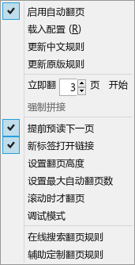

uAutoPagerize 中文规则版
========================

### uAutoPagerize.uc.js

基于 [Griever 的 uAutoPagerize](https://github.com/Griever/userChromeJS/tree/master/uAutoPagerize) 修改，参考了 [Super\_preloader](http://userscripts.org/scripts/show/84937)

 - 新增 [Super\_preloader.db](https://userscripts.org/scripts/show/142198) 规则的支持，几乎完美兼容该规则，支持 `auto;`、`css;`、函数、地址栏递增等多种方式
 - 能下载更新 Super\_preloader.db 的规则，文件名为 `uSuper_preloader.db.js`（Chrome目录下）
 - 新增 **本人维护的规则**，也可添加多个他人规则
 - 新增 **iframe加载下一页**（浏览器级），以便支持一些特殊网站：如起点或漫画网站
 - 新增 **立即加载n页** 功能
 - 新增 **强制拼接** 功能，在没有规则且能通过自动查找找到下一页链接的才可用
 - 新增 **提前预读** 功能，就是翻完第1页,立马预读第2页,翻完第2页,立马预读第3页..(大幅加快翻页快感-_-!!)
 - 新增 **最大翻页数** 的设置
 - 原官方规则优先级最低，默认启用。略大，但很多网站都可翻页。可设置为禁用 `var ORIGINAL_SITEINFO = false`
 - 默认为可移动按钮，可在 `isUrlbar` 更改，true为地址栏，false为附加组件栏（可移动按钮）

#### 特殊的支持

iframe 加载方式默认只启用 JavaScript、Image，节省资源

 - *百度贴吧* 修复下一页图片的点击放大和回复按钮的可用
 - *Google* 搜索页面修复下一页图片或视频缩略图
 - *VeryCD* 搜索页面修复下一页图片
 - *youtube* 搜索页面修复下一页图片
 - *抽屉新热榜* 修复下一页图片，推荐、收藏、评论点击

#### 按钮右键菜单

#### 分页导航

### SITEINFO_Writer.uc.js

 - 新增 AutoPager Rules 搜索和点击 `install` 读取规则并弹出对话框
 - 新增 **读取当前页面规则** 的功能，当前页面已经运行的规则会加粗
 - 新增 **从剪贴板读取规则** 的功能
 - 新增 **查看规则(SP)** By lastdream2013，导出规则为 Super_preloader 格式
 - 新增 useiframe
 - 新增 auto; 或 css; 写法的支持
 - 新增选取时中文下一页的 xpath 显示

## 文件简介

 - [uAutoPagerize.uc.js](uAutoPagerize.uc.js)，脚本文件。
 - [_uAutoPagerize.js](_uAutoPagerize.js)，自己的配置文件，可设置排除列表，添加规则。
 - [SITEINFO_Write.uc](SITEINFO_Writer.uc.js)（非必须），规则辅助查找工具（修改版），在 AutoPager Rules 网站点击 install 后自动读取规则并弹出对话框。
 - AutoPagerizeFindHighlight.uc.js（辅助，非必要）。google搜索等下一页高亮的修正。使用我修改过的 WordHighlightToolbar.uc.js 则不需要。
 - AutoPagerize_IDE.js，AutoPagerize的书签工具，暂不可用。

## 使用注意

 - 如果加载的下一页以图片为主，内存占用会不断加大（文字则完全不受影响）。建议点击 第 XX 页 链接，关闭当前页面，继续阅读。
 - 按钮图标鼠标中建载入自己的配置，右键弹出菜单

## 添加排除列表

在文件 _uAutoPagerize.js 中，模仿下面的格式添加

    // 排除列表
    var EXCLUDE = [
        'https://mail.google.com/*'
        ,'http://www.google.*/reader/*'
    ];

## 配合鼠标手势或其它工具调用的代码

启用禁用

	uAutoPagerize.toggle()

立即加载3页

    uAutoPagerize.loadImmediately(3);

向下滚一页，否则向下滚一屏（FireGestures代码）。

	if(content.window.ap){
		return uAutoPagerize.gotonext();
	}
	FireGestures._performAction(event, "FireGestures:ScrollPageDown");

向上滚一页，否则向下滚一屏（FireGestures代码）。

	if(content.window.ap){
		return uAutoPagerize.gotoprev();
	}
	FireGestures._performAction(event, "FireGestures:ScrollPageUp");

## 站点配置说明

    {   name: 'Google搜索',
        url: '^https?\\:\\/\\/(www|encrypted)\\.google\\..{2,9}\\/(webhp|search|#|$|\\?)',  //url 2种方式：正则和普通 * 号方式
        // url: 'wildc;http*://www\\.google\\.com\\.hk/search*',

        nextLink: 'auto;',  // 下一页链接 xpath 或者 CSS选择器 或者 函数返回值(此函数必须使用第一个传入的参数作为document对象) (~~必选~~)
        //nextLink:'//table[@id="nav"]/descendant::a[last()][parent::td[@class="b"]]',
        //nextLink:'css;table#nav>tbody>tr>td.b:last-child>a',
        //nextLink:function(D,W){return D.evaluate('//table[@id="nav"]/descendant::a[last()][parent::td[@class="b"]]',D,null,XPathResult.FIRST_ORDERED_NODE_TYPE,null).singleNodeValue;},

        useiframe:false,   // 是否使用iframe翻页(可选)
        iloaded:false,     // 是否在iframe完全load之后操作..否则在DOM完成后操作(可选)

        //pageElement: '//div[@id="ires"]',  //主体内容 xpath 或 CSS选择器 或函数返回值(~~必须~~)
        pageElement: 'css;div#ires, div#res',
        //pageElement:function(doc,win){return doc.getElementById('ires')},
    },

## 高级规则说明

对页面的处理，`this`: 网页window，`this.wrappedJSObject`: 网页window对象

 - startFilter(win, doc): 对原始网页的处理，这个的前提是能顺利找到 nextLink, pageElement
 - requestFilter(opt): 对 GM_xmlhttpRequest 参数的处理
 - responseFilter(res, requestURL): 对接收到的 response 处理
 - documentFilter(doc, requestURL, info): 对下一页的 document 处理
 - fragmentFilter(fragment, doc, pages): 对用 info.pageElement 找到的 fragment 处理
 - filter(pages): 对添加后的 pages 处理

### 例：verycd 搜索的下一页图片的修复。

    {name: 'VeryCD搜索页面',
        url: /http:\/\/www\.verycd\.com\/search\/folders.+/i,
        siteExample: 'http://www.verycd.com/search/folders/firefox',
        nextLink: '//ul[@class="page"]//a[contains(text(),"下一页")][@href]',
        pageElement: '//ul[@id="resultsContainer"]',
        fragmentFilter: function(df) {
            Array.slice(df.querySelectorAll('.cover img')).forEach(function(img) {
                img.src = img.getAttribute('_src');
                img.removeAttribute('_src');
            });
        }
    },

### 例：Google 搜索下一页图片和视频的修复

因为 Google 常用，所以我采用下面的方式，但可能因为网站改版或其他原因而失效，此时改用 `useiframe: true,` 也可解决。

    {name: 'Google搜索',
            url: '^https?\\:\\/\\/(www|encrypted)\\.google\\..{2,9}\\/(webhp|search|#|$|\\?)',  // url 2种方式：正则和普通 * 号方式
            nextLink: 'id("pnnext")|id("navbar navcnt nav")//td[span]/following-sibling::td[1]/a|id("nn")/parent::a',

            useiframe: false,   // 是否使用iframe翻页(可选)
            pageElement: 'css;div#ires',
            // fix Google image and Video
            documentFilter: function(doc){
                var x = doc.evaluate(
                    '//script/text()[contains(self::text(), "\',\'data:image/jpeg") or contains(self::text(), "\',\'http://")]',
                    doc,
                    null,
                    9,
                    null).singleNodeValue;
                if (!x) return;

                var datas = x.nodeValue.match(/'\w+','data:image\/jpeg\;base64\,[A-Za-z0-9/+]+(?:\\x3d)*/g) ||
                    x.nodeValue.match(/'\w+','http[^']+'/g) || [];

                datas.forEach(function(text){
                    let [id, data] = text.split("','");
                    id = id.slice(1);
                    let m = doc.getElementById(id);
                    if(m)
                        m.src = data.replace(/\\x3d/g, "=");
                });
            }
        },
    }